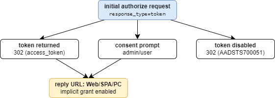
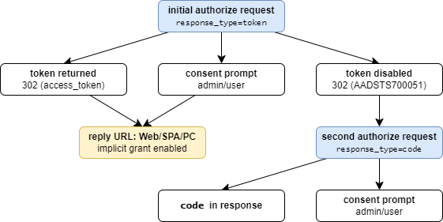
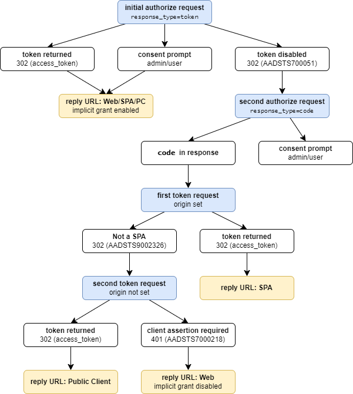
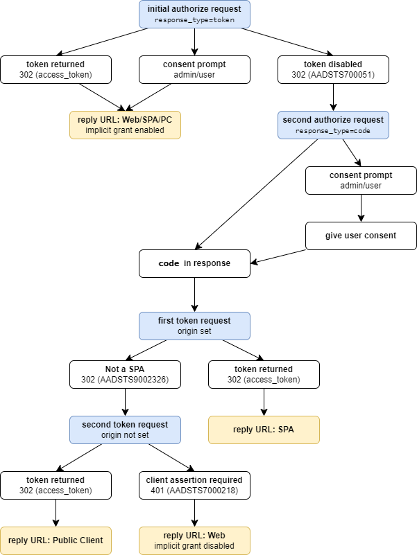

+++
title = 'Automating the enumeration of missing reply URLs in Azure multitenant apps'
date = 2024-07-23
draft = false
summary = 'In my previous post, I showed the impact that an unregistered reply URL can have in an Azure tenant and how to enumerate them for single tenant applications. This time, we take it one step further and introduce a tool that allows enumerating single and multitenant applications without user interaction.'
+++

> Post co-published at [FalconForce blog](https://falconforce.nl)

## TLDR
In my [previous blog post](https://explorer953.github.io/posts/arbitrary-1-click-tenant-take-over-via-ms-application), I showed the impact that an unregistered reply URL can have in an Azure tenant and how to enumerate them for single tenant applications. This time, we take it one step further and introduce a tool that allows enumerating single and multitenant applications without user interaction.

Check out the tool [here](https://github.com/FalconForceTeam/reply-url-brute).

## Revisiting the problem
As explained in the last post, unregistered reply URLs for Azure applications can be abused to impersonate users, just by luring them to click on a link; which in the worst case can lead to a complete tenant takeover.

In that same blog post, I shared a short PowerShell script that enumerates which Azure applications registered in the tenant have missing reply URLs and if they were abusable. This is fine and hopefully handy. However, these are not the only applications that are available in your tenant. For example, the reply URL that allowed a 1-click tenant takeover was from a Microsoft application and the script I shared couldn't identify it.

In fact, that reply URL was (luckily) identified by manually trying and shuffling between several lists of potential candidates, far from an ideal workflow. So, how can this be automated?

## Applying the same process to multitenant apps
Our objective here is to discover abusable unregistered reply URLs in multitenant apps and do it without user interaction. The methodology to accomplish this could be more or less the same as to the one used in the script I shared in the last blog post. So, let's examine that script step by step and figure out if it could be ported to enumerate multitenant apps.

The script starts by getting all the applications defined in the tenant with the following  PowerShell function from the `Az` module:

```powershell
$apps = Get-AzADApplication
```

Since now we are interested in all service principals available in the tenant, this part can easily be replaced by `Get-AzADServicePrincipal`.

Then the script continues by defining a *for* loop through all the applications obtained and checking if they have defined a reply URL:

```powershell
$appsAbusableReplyURL = @()
foreach ($app in $apps){
    # Skip apps which don't have reply URL defined
    if ([string]::IsNullOrEmpty($app.Spa.RedirectUri) -and
        [string]::IsNullOrEmpty($app.PublicClient.RedirectUri) -and
        [string]::IsNullOrEmpty($app.Web.RedirectUri)){
        continue
    }
    ...
```

This can also be easily ported, since the reply URLs are present in the service principals' properties returned by `Get-AzADServicePrincipal`:

```
GET /v1.0/servicePrincipals?$filter=AppId%20eq%20%271950a258-227b-4e31-a9cf-717495945fc2%27
Host: graph.microsoft.com
...

HTTP/2 200 OK
...
{
    "value": [
        {
            "replyUrls": [
                "https://login.microsoftonline.com/common/oauth2/nativeclient",
                "http://localhost",
                "urn:ietf:wg:oauth:2.0:oob",
                "ms-appx-web://microsoft.aad.brokerplugin/19..."
            ],
            ...
        }
    ]
}
```

Next, the scripts checks different conditions based on the URL type. For single-page applications (SPAs) and public clients it only checks if the domain is available, but for web clients it also checks if the implicit grant is disabled.

```powershell
...
$app.Spa.RedirectUri |% {
    if (missingHTTPUrl -url $_) ...
}

$app.PublicClient.RedirectUri |% {
    if (missingHTTPUrl -url $_) ...
}
$app.web.redirectUris |% {
    if ($app.web.ImplicitGrantSetting.EnableAccessTokenIssuance -and
        (missingHTTPUrl -url $_)
    ) ...
}
```

Here we hit the first problem: it's necessary to figure out the type of the reply URL to decide if an application is vulnerable to reply URL hijacking or not. It doesn't matter if an application has multiple unregistered reply URL ready to be taken over; if they are all part of a web client, we can't take advantage of them.

Unfortunately for us, the reply URL type is not present in the properties of a service principal returned by the Microsoft Graph API.

#### Undocumented Windows Graph API to the rescue! ...not today
The Windows Graph (graph.windows.net) exposes several API endpoints which are undocumented and in some cases return more information than the traditional ones. I became aware of them thanks to the [ROADtools](https://github.com/dirkjanm/ROADtools) project by Dirk-Jan Mollema.

```
GET /<tenant_id>/applicationRefs/1950a258-227b-4e31-a9cf-717495945fc2?api-version=1.61-internal HTTP/1.1
Authorization: Bearer eyJ...
Host: graph.windows.net
...

HTTP/1.1 200 OK
...

{
    "publicClient": true,
    "replyUrls": [
        "https://login.microsoftonline.com/common/oauth2/nativeclient"
        ...
    ],
    ...
}
```

The response returns a boolean for `publicClient`. Based on the name I'd assume it indicates if the app can be used by public clients (a.k.a *native clients* or *Mobile Desktop Applications*). But even if that was the case, this would provide limited information: we don't know which one of the URLs defined in the application is configured as a public client. Also, what about the reply URLs for SPA applications? They are not considered public clients, but can definitely be used for this attack. Anyway, according to my testing this value has proven to not be entirely reliable. For example, for MS applications the `publicClient` value matched the value expected of the application. But for the other applications, it did not change when setting or removing public clients reply URLs.

At the end, even though in some cases these APIs are very handy (i.e., you can enumerate reply URL for applications not imported in your tenant, a feature that has been used in the final script), in this case they don't help. There must be a better way.

## Figuring out the reply URL type with trial and error
Since APIs don't seem to provide all the information necessary, it looks like we'll need to get it piece by piece; by exploring all the potential paths authentication flows can take, and doing this for each one of the unregistered reply URLs we identify.

So let's go back and start from zero. We know that most Azure OAuth flows start with an authorize request:

```
https://login.microsoftonline.com/organizations/oauth2/v2.0/authorize?
client_id=89bee1f7-5e6e-4d8a-9f3d-ecd601259da7
&redirect_uri=https%3A%2F%2Fwebshell.suite.office.com%2Fiframe%2FTokenFactoryIframe
&scope=https%3A%2F%2Fgraph.microsoft.com%2F.default%20openid%20profile%20offline_access
&response_mode=fragment
&response_type=code
&code_challenge=inlt...GGgY
&code_challenge_method=S256
&nonce=as...
```

All the parameters involved in such request were already explained in the [previous post](https://explorer953.github.io/posts/arbitrary-1-click-tenant-take-over-via-ms-application), so I'm not going to repeat them here. However, there's one that we need to pay special attention to: the `response_type`. Depending on the reply URL type, we must set this parameter to `code` for SPA and public clients or `token` for implicit grant flows.

Let's say we send an authorize request with a `response_type` sent to `token` and  implicit grant is disabled in the application:

```
HTTP/1.1 302 Found
Location: https://idontexist.idontexist/#error=unsupported_response_type&error_description=AADSTS700051%3a+response_type+%27token%27+is+not+enabled+for+the+application.+Trace+ID%3a+500ad936-7f89-40a5-836f-aa7374991101+Correlation+ID%3a+e658abe4-a3bb-4603-8129-1942d95659c5+Timestamp%3a+2024-07-10+12%3a19%3a49Z&error_uri=https%3a%2f%2flogin.microsoftonline.com%2ferror%3fcode%3d700051
...
```

Azure returns a redirect with an error stating implicit grant is disabled for this application. Therefore, the reply URL can't be used with the implicit grant flow. 

On the other hand, if implicit grant is enabled:

```
HTTP/1.1 302 Found
Location: https://idontexist.idontexist/#access_token=eyJ0e...
...
```

In this case, we will get an access token! But only if the app has been consented previously or is pre-authorized. In any other case, the consent prompt will appear to ask for user confirmation before issuing tokens. If we asked a scope that can only be granted by an admin, the process will stop, and a different message will appear. But in all these cases, we can conclude that this application has implicit grant enabled. Consider that under these circumstances we don't know if the reply URL is either a web, a SPA or a public client. Although it barely maters, because implicit grant makes all of them vulnerable.

And there we have it. Maybe we still don't have the complete picture, but just by sending one request we have more information than before about how the application is configured. Let's keep track of these results in a graph before  things start branching out even more.



We continue by sending another authorize request. This time with `response_type` set to `code`. The following response is returned:

```
HTTP/1.1 302 Found
Location: http://localhost/?code=0.A...bw
...
```

As expected by the authorize flow, the response returned by the server is a redirect to the reply URL type we passed with the variable `code` as a get parameter. Great, right? Well, not that fast, as we'll see in the following requests. At this point, we still don't have enough information to decide anything.

Another response that can be returned is a consent grant page again, but we'll explore this path later.

We can update the graph with this new information:



We keep following the authorize flow. This time we send a request to the token endpoint with the code returned previously:

```
POST /<tenant_id>/oauth2/v2.0/token HTTP/1.1
Origin: anything
Host: login.microsoftonline.com
...

client_id=1950a258-227b-4e31-a9cf-717495945fc2
&redirect_uri=http%3A%2F%2Flocalhost
&code=0.A...bw
&grant_type=authorization_code
```

The parameters involved in this request were also explained in detail in the previous post and won't be commented here. Instead, we focus again on the potential response that can be returned:
- A **token is returned**: success! We identified a reply URL of type SPA.
- An error is returned mentioning the **application is not an SPA**: this is a hint that maybe the reply URL type is a public client.

The main difference between an SPA and a public client is that the request must have an `origin`header. Therefore, we just need to send another request to the token endpoint without the origin header, and if an access token is returned then we confirm the reply URL type is a public client. But if this fails and the following error message is received: **client secret or assertion is required**, this will be the final confirmation that the URL type is a web client with implicit grant is disabled and therefore, not abusable.

Let's keep updating the graph:



The thing is starting to look pretty much complete and we could leave it here. However, there's one place where we are missing information. If a certain application has never been used in a tenant by a user before, the applications is very likely to ask for consent. Additionally, we could be sending the initial authorize requests with a scope set to `https://graph.microsoft.com/user.read`, but the application could be consented only for another permission. This means in both situations we could be missing potential candidates, or on the other hand, dealing with too many false positives.

An attempt to fix this would be to brute-force scopes until we find one that is already granted; and then continue with the flow to determine if the reply URL is actually vulnerable (scope brute-forcing will be explained in more detail in the upcoming sections). This would end up being very inefficient, because we could have thousands of potential candidates at this point. A better approach would be to automatically give consent to all applications requesting it, to attempt to continue with the authorize flow. In this way, we could figure out which reply URLs are actually vulnerable, regardless of the scope requested.

## Giving consent automatically
After a bit of playing around with Burp and Azure requests, we found out the following request, which needs to be sent immediately after the authorize request, is used to give consent.

```
POST /<tenand_id>/Consent/Set HTTP/1.1
Host: login.microsoftonline.com
Cookie: ESTSAUTHPERSISTENT=0.AVAA...
...

acceptConsent=true&
ctx=rQQI...rnAE1&
flowToken=AQABI...gAA&
canary=cB1o...3D
```

Luckily for us, all these parameters are provided in the authorize response received before. Also, the response to this request is very similar, if not the same, to the one returned if no consent was required; a redirect with an authorization code in the URL's get parameters.

```
HTTP/1.1 302 Found
Location: http://localhost/?code=0.AVAA...1QIA
...
```

This is very handy, because we can connect this response to the main path pretty easily;  simplifying the enumeration process a bit.

And finally, we have a complete graph:



At this point, we have designed a methodology to figure out the reply URL type of an arbitrary service principal. Valid for both multitenant and regular applications, plus - since we just used requests of normal OAuth flows - no special user rights are required.

In practice, this graph ends up being considerably more complex, as Azure can return a lot of different [errors messages](https://learn.microsoft.com/en-us/entra/identity-platform/reference-error-codes#aadsts-error-codes) which further complicate all this logic. After a lot of time spent in testing, I attempted to take care of all the fringe cases that were coming up, by coding the proper error handling in the script. Unfortunately, there's going to be cases where an unexpected error is returned. In that scenario, the script will assume the reply URL is not abusable and will skip to the next one, after reporting the error to the terminal.

## Scope brute forcing
The process above explains the basic idea behind the reply URL enumeration for multitenant applications. However, if we want to find permissions already granted by a user to avoid triggering the consent prompt, we need to pay special attention to the scope parameter.

As we have learned in the previous post about this topic, our authorize request must exactly match, via the scope parameter, the permissions that are already consented in the service principal if we don't want to trigger a consent prompt. Keep in mind that, thanks to [dynamic consent](https://learn.microsoft.com/en-us/entra/identity-platform/consent-types-developer#incremental-and-dynamic-user-consent), any scope can be requested; even if it's not configured in the application registration itself.

Therefore, by brute-forcing potential scope candidates, we can find out which permissions are already granted by the user or - more likely - pre-consented permissions tenant-wide by an admin. Or even more interesting: pre-authorized permissions by the application where the resource is defined.

## Skipping the login screen: the ESTSAUTHPERSISTENT cookie
Before throwing all that logic in a Python script, there's one issue we must address. Any request to the authorize endpoint must be properly authenticated. If not, the server will return a redirect to the Microsoft login portal where you'll need to enter your credentials, complete the MFA requirements, etc. However, when you copy that string in a browser with a session open, no login screen is ever shown and you are properly taken to the corresponding application.

The mechanism that is being used under the hood to bypass the login screen, MFA challenges and other requirements, is just a cookie; specifically the `ESTSAUTH` or the `ESTSAUTHPERSISTENT` cookie. With one of these cookies present in the authorize request, Azure will skip any login screen in the flow (except for the ones corresponding to consent granting) and take you straight to the redirect, access token, etc. (or fail 🙃).

More information about these and other interesting cookies can be found [here](https://learn.microsoft.com/en-us/entra/identity/authentication/concept-authentication-web-browser-cookies).

## Automate all the things: reply-url-brute.py
All the logic explained until now has been coded into a Python script. Plus, additional methods have been added to make the output as useful as possible. The script consists of the following steps:
1. **Initialize** variables and request access tokens for Microsoft Graph (graph.microsoft.com), Azure Active Directory Graph (graph.windows.net) and several others.
2. **Request service principals** in the tenant using the Microsoft Graph API.
3. **Enrich service principals'** reply URLs using the undocumented Azure Active Directory Graph.
4. Start **DNS resolution** of all reply URLs; keep the ones that aren't found.
5. Check in **Azure Resource Manager** if the resource to take over the domain is available. More often than not, the resource name that would allow to take over a certain domain is unavailable. I imagine this is due to the fact a developer created the resource, but then left it in a disabled step. Even though writing checks for most of the resources was an awfully time-intensive endeavor, it really helped in bringing down the number of false positives. Shout out to the guys at Stratus Security for collecting a very [comprehensive list of Azure domains take over](https://www.stratussecurity.com/post/azure-subdomain-takeover-guide).
6. Apply the steps explained in the previous sections to **determine if a given reply URL can be taken advantage of**. Optional: consent user scope automatically.
7. Reapply the same process in point 6 but for a **set of different scopes**.
8. Take all the information gathered in the previous points and present it in a human-friendly way.
9. Every time a request to the authorize endpoint is made, Azure returns a new `ESTSAUTHPERSISTENT` cookie. At the end of the enumeration, the script will overwrite the values in the `config.yaml` file, so the cookies are always up to date.

#### Demo
Clone the project and open the `config_doc.yaml`:

```
git clone https://github.com/FalconForceTeam/reply-url-brute
```

You need to provide several pieces of information before running the script for the first time. Set the tenant ID and the subscription ID in the appropriate fields:

```
subscription_id: 4493ad17-...
tenant_id: 2a0002d5-2368-...
...
```

Now, we need to set the `ESTSAUTHPERSISTENT` cookie. To get it, I recommend to open Microsoft Edge, navigate to https://portal.azure.com and log in. When it asks you to stay signed in, click "Yes", so the `ESTSAUTHPERSISTENT` is properly set. Then go to "Settings" > "Cookies and site permissions" > "Manage and delete cookies and site data" > "See all coolies and site data". Expand the domain "microsoftonline.com" and then "login.microsoftonline.com". Then copy the value for the `ESTSAUTHPERSISTENT` cookie.

Some considerations to keep in mind:
- No special rights in Entra ID are required for the user.
- To check for Azure resource availability, the user must have access to a subscription. The easiest way is to provide read-only access to the subscription, but access to any resource should work anyway.
- You could also use the `ESTSAUTH`, but then it's possible you'd get some issues in the long term, since it doesn't last as long.

```
subscription_id: 4493ad17-...
tenant_id: 2a0002d5-2368-...
token_user_ro: 0.AV8AzUIqqYy...
```

Finally, save the file as `config.yaml`.

To run the script against all the service principals available in the tenant, just run it without arguments. Alternatively, you can also use some of the available **CLI arguments**:
- `--appId`: only checks one specific application. Thanks to the undocumented internal Azure Active Directory API, the application doesn't need to be present in the tenant.
- `--auto-consent-user`: Automatically accept consent for `https://graph.microsoft.com/user.read` scope to improve results fidelity.
- `--scope`: by default, there are 11 scopes hardcoded in the script. Pass this option to overwrite them.
- `--scope-list`: you can also pass the path to a file with a list of scopes to check. Every scope must be in a new line.

**Output:**
- The output is similar, regardless if a single application is tested or all the ones present in the tenant. The same is true when it comes to the number of scopes tested.
- Depending on the number of service principals, the script can take a lot of time, but it greatly depends on the number of reply URLs per application and the scopes to test. For example, for a tenant with 1000 service principals and the default scope list, it can take more than 30 minutes.
- The script output is very verbose, skip to the reporting step to have a quick summary of the findings.
- **DNS resolution step**:
    - `No`: an unregistered reply URL has been found, but the domain can't be taken over.
    - `Maybe`: an unregistered reply URL has been found, but there's no method to check whether the resource that would register the domain is available.
    - `Yes`: an unregistered reply URL has been found and the resource is available.
- **Flow and scope brute force step**:
    - `Maybe`: the application asked for consent and therefore it's not sure if the reply URL is vulnerable or not. Consider using `--auto-consent-user`.
    - `YES!`: the application returned access tokens for the given scope.
- **Reporting step**: summary of all the applications vulnerable to the reply URL hijack, plus its accepted scopes.

```
python reply-url-brute.py --appId 89efd99e-0ec9-4bcf-9e5c-74c31b45f181

[*] Loading tenant informacion and cookies from config.yaml file: config.yaml
[*] Tenand ID: a92a42cd-bf8c-46ba-aa4e-64cbc9e030d9
[*] Subscription ID: 80110e3c-3ec4-4567-b06d-7d47a72562f5

STEP: Get tokens for MS Graph, APP MGMT and AAD
[*] Send Authorize for scope: https://graph.microsoft.com/Directory.AccessAsUser.All
[*] Send Token request for scope: https://graph.microsoft.com/Directory.AccessAsUser.All
[*] Send Authorize for scope: https://graph.windows.net/user_impersonation
[*] Send Token request for scope: https://graph.windows.net/user_impersonation
[*] Send Authorize for scope: https://appmanagement.activedirectory.microsoft.com/user_impersonation
[*] Send Token request for scope: https://appmanagement.activedirectory.microsoft.com/user_impersonation

STEP: Single AppId mode
[*] Quering AppId
[+] Response: 200, Service Principals: 1

STEP: Query reply URLs via Windows Graph
[*] Reply URLs from Windows Graph, SP: app-demo: +0

RECAP: The appId could be found:
[*] app-demo, 89efd99e-0ec9-4bcf-9e5c-74c31b45f181, replyUrls:
    https://localhost
    https://idontexist23843.azurewebsites.net

STEP: Get tokens for ARM
[*] Send Authorize for scope: https://management.azure.com/.default
[*] Send Token request for scope: https://management.azure.com/.default

STEP: Starting DNS resolution of reply URLs
[*] Checking availability for idontexist23843.azurewebsites.net: Available!
[+] Domain not found, take over: Yes,   SP: app-demo, https://idontexist23843.azurewebsites.net
[*] SP with missing reply URLs + take over (Yes, Maybe): 1
[*] SP with missing reply URLs but no take over: 0, this won't be checked

STEP: Starting flow bruteforce
[*] app-demo, https://idontexist23843.azurewebsites.net, scope: https://graph.microsoft.com/User.Read
[*] Authorize request, Web: NO, response_type 'token' not enabled, implicing grant disabled
[*] Authorize request, SPA: Maybe, needs user consent
...
[*] Total vulnerable Apps: 1

STEP: Starting scope bruteforcing
[*] Scopes to bruteforce: 17
[*] SP: app-demo, https://idontexist23843.azurewebsites.net (SPA/Desktop), scope: https://graph.microsoft.com/.default
[*] Authorize request, SPA: Auth code found
[*] Token request, SPA (origin): YES!
[+] Found vulnerable reply URL:
      Type: SPA
      Display name: app-demo
      Appid: 89efd99e-0ec9-4bcf-9e5c-74c31b45f181
      Reply URL: https://idontexist23843.azurewebsites.net
      Token resource: https://graph.microsoft.com
      Token scope: Directory.AccessAsUser.All

[*] SP: app-demo, https://idontexist23843.azurewebsites.net (SPA/Desktop), scope: https://graph.microsoft.com/User.Read
...
[*] Final total vulnerable Apps: 1


REPORTING: Reporting SP - reply - scopes
[*] SP: app-demo, scope: https://graph.microsoft.com/user.read, consent: Granted!
[*] SP: app-demo, scope: https://graph.windows.net/Directory.AccessAsUser.All, consent: Granted!
[*] SP: app-demo, Reply Url: https://idontexist23843.azurewebsites.net

[+] Saving cookies to config.yaml
```

In this example, we see how the `app-demo` has the reply URL `https://idontexist23843.azurewebsites.net` set as a SPA. We also see how the application has defined several OAuth permissions, but most of them require a consent by the user or an admin. However, the scope `https://graph.windows.net/Directory.AccessAsUser.All` has been granted and the application returned tokens for that. Therefore, if we register the `idontexist23843` as a new Azure website, we could impersonate the user in the tenant, just by luring him to follow a link.

## Takeaway
- With the tool presented here, we can finally explore and enumerate the attack surface that multitenant applications have in a tenant. The best of it: it's fully automated.
- For red teamers, this offers a new way to attack a tenant, once you get access to user credentials.
- While you can keep a tight control of the applications defined in your tenant, third party providers may not be as careful. With this tool, we hope you can keep an eye on your reply URLs.